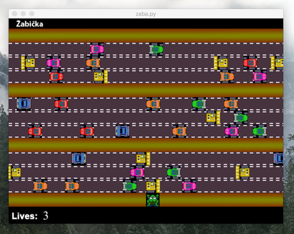

Žába
====

Historický kontext
------------------

Jsme si říkali, že závěrečný projekt může být žába, ale potřebovali bychom k tomu vytvořit materiály, tohle máme od Lumíra z Ostravy:

> Už nějakou dobu přemýšlím, zda by nebylo dobré vytvořit alternativu k závěrečnému projektu, aby si účastnice mohly vybrat. Jednak proto, že se Asteroidy některým zdají až příliš složité a tak se do projektu vůbec nepustí, ale také proto, že je pro některé vesmírnná fyzika španělskou vesnicí a pak implementují i automatické zpomalení raketky atp. Nápadů jsem měl několik, ale všechny tak nějak troskotaly na tom, že se na nich špatně demonstrovaly objekty a hlavně dědičnost. Teď se mi do rukou dostalo zadání z nějaké programátorské soutěže pro středoškoláky, kde měli za úkol implementovat hru Frog - tedy starou známou hru, ve které jde žába přes cestu a během cesty ji nesmí srazit žádné auto. Hra je pro začátek velmi jednoduchá na implementaci a dědičnost ve formě několika různých pohybujících se objektů jde také použít. Zároveň se hra může, stejně jako Asteroidy, vylepšovat až do absurdna. Co myslíte, mělo by smysl si tuto hru zkusit naimplementovat a sepsat k ní manuál ve stylu Asteroidů?

Zadání: FROG
------------

Hrací plocha je dálnice s obrázkem `pozadi.bmp`. Na dálnici vygenerujte 12 autíček (můžete i více, které se pohybují po dálnici v různých pruzích – obrázky `1.bmp` až `12.bmp`.

Žába (obrázky `frog1.bmp` až `frog4.bmp`) je na začátku dole a postupně je jejím úkolem projít přes dálnici tak, aby ji nezajelo žádné auto.

Během hry:

- Žába chodí po ploše podle událostí z klávesnice – vlevo, vpravo, nahoru, dolů, vždy o 32 bodů.
  Současně mění obrázek podle aktuálního směru pohybu.

- Pokud se žába setká s autem, ubere se jí jeden život

- Na začátku má žába 3 životy.

- Pokud žába ztratí všechny 3 životy, hra končí

- Pokud žába projde přes cestu na druhou stranu, hra končí úspěchem.
